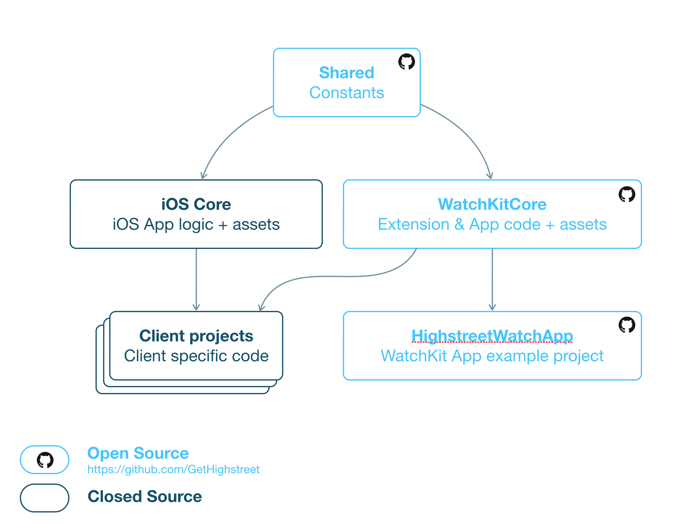

# WatchKitCore
The core logic &amp; assets for Highstreet WatchKit Apps

This repository consists of two parts: the code for `WatchKitExtensionCore.framework`, built using the `WatchkitExtensionCore.xcworkspace` and the assets for the WatchKit App target (storyboard, PNG sequences and other assets). 

To see this code in action, check out https://github.com/GetHighstreet/HighstreetWatchApp.

# Project Outline
WatchKitCore is part of our Highstreet platform. Highstreet is a platform for mobile shopping apps. At the center of the platform, there is the ‘Highstreet iOS Core’. It contains all business logic and interface code for the iPhone & iPad app. The core is imported in each client project, where it is configured for that specific client. As a result, our customers all get an app that looks and feels like their brand, but the app shared 99% of the code with other Highstreet apps.

With the introduction of Apple Watch, the Highstreet platform now has a second 'core' that is used for the WatchKit Apps: WatchKitCore (this repository). WatchKitCore consists of two parts: the logic that is linked in every WatchKit Extension target (`WatchKitExtensionCore.framework`) and the assets for the WatchKit App target (storyboard, PNG sequences and other assets).

WatchKitCore on itself cannot run. It needs to be linked into a client project. A regular client project contains branded iPhone & iPad apps, in addition to the WatchKit App. Since we're not Open Sourcing the 'iOS core', we've created an example project that only contains the WatchKit app: https://github.com/GetHighstreet/HighstreetWatchApp.

The following diagram shows the relation between the components of the Highstreet platform:

# Installation

# License
All code is available under the MIT License. All other assets are available under the CC BY 4.0 License.
